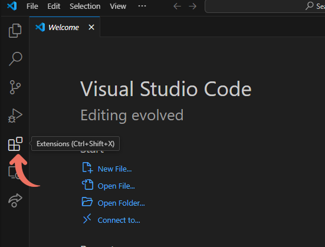

# De cero a héroe

Estos pequeños tutoriales apuntan a que puedas aprender a pensar y escribir código para ayudarte en tus tareas diarias.

Con suerte, cada programa simple que escribiremos, te ayudará a entender conceptos de algoritmia y a escribir código que te ayude a mejorar o incluso automatizar como realizas tareas en tu dia a dia.

En este tutorial, vamos a configurar un entorno de desarrollo, instalaremos un editor de código, Python (un lenguaje de programación) y escribiremos nuestro primer programa.

## Visual Studio Code

Descarga e instala el editor de código [Visual Studio Code](https://code.visualstudio.com/) desde su página oficial. Esta sera nuestra principal herramienta para escribir y ejecutar nuestros programas.

Instala la extensión de Python si no viene incluida. Haz click en el menú de extensiones en la barra lateral.



Revisa si la extensión Python (por Microsoft) está instalada. Si no lo está, instalala buscándola en el Marketplace de extensiones y agrégala al editor de código.


## Instalar Python

Para estos tutoriales, usaremos Python, un lenguaje de programación muy popular, poderoso, y fácil de utilizar.

### Usando Chocolatey (Recomendado)

Instala [Chocolatey](https://chocolatey.org), un "gestor de paquetes" para entornos Windows.

Chocolatey te ayudará a instalar o actualizar software de programación a través de una interfaz de línea de comandos.

Presiona la tecla `Windows` y busca el programa `Powershell`, haz click derecho en el resultado de búsqueda y selecciona la opción de `Ejecutar como administrador`.


Vé a [la página de instalación de Chocolatey](https://chocolatey.org/install) y sigue las instrucciones ejecutando el comando recomendado en tu terminal `Powershell`.

Repite las instrucciones más arriba para abrir otra terminal `Powershell` con permisos administrativos y ejecuta el siguiente comando para instalar `Python`.

```powershell
choco install python
```

El proceso te pedirá permisos para instalar software requerido.

Una vez todo haya terminado, puedes abrir otra terminal (sin permisos administrativos esta vez) y ejecutar el siguiente comando para asegurarte de que `Python` está instalado.

```powershell
python --version
```

### Directamente

Ve a [la Página de instalación de Python para Windows](https://www.python.org/downloads/windows/) y descarga el instalador para Windows(`Windows installer`). Asegúrate de descargar el instalador apropiado para tu máquina (`64-bit` o `32-bit`).

Para determinar cuál necesitas, Abre el menú de inicio, presionando la tecla `Windows` o haciendo click en el botón de inicio, y seleccionando las siguientes opciones  `Configuración` > `Sistema` > `Acerca de`. A la derecha, bajo `Especificaciones del dispositivo`, verás el `Tipo de sistema`.

## Hola mundo!

Crearemos una carpeta (directorio) para iniciar nuestro viaje de programación. Puedes iniciar guardando la carpeta `Programacion` (`<Programacion>` de ahora en adelante) en tu carpeta de Documentos.

Abre la carpeta desde Visual Studio Code, usando el atajo para `Abrir directorio`, o seleccionando la opción a través del menú (`Archivo` > `Abrir carpeta`).


Crea una nueva carpeta para esta sección llamada `1-hola-mundo`, ya sea desde tu explorador, o directamente desde el editor.


Crea un nuevo archivo con nombre `hola-mundo.py`.


Haz click en el nuevo archivo para abrir la ventana de edición. Escribiremos el siguiente código en el editor:

```python
print("Hola mundo")
```

Asegurate de guardar tu archivo antes de ejecutarlo (`Archivo` > `Guardar`). Tendrás un indicador en la pestaña en la que estas trabajando si tu archivo tiene cambios sin guardar.

Finalmente, haz click en el botón "play" para ejecutar tu programa.


Sigue así
