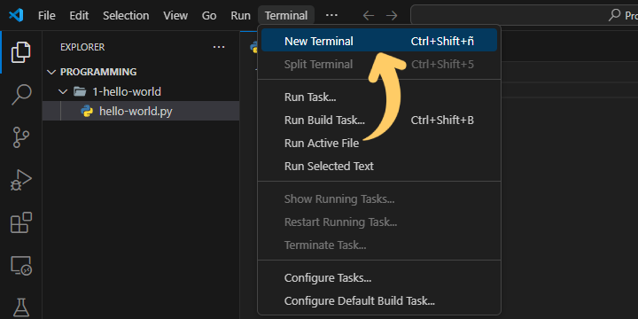
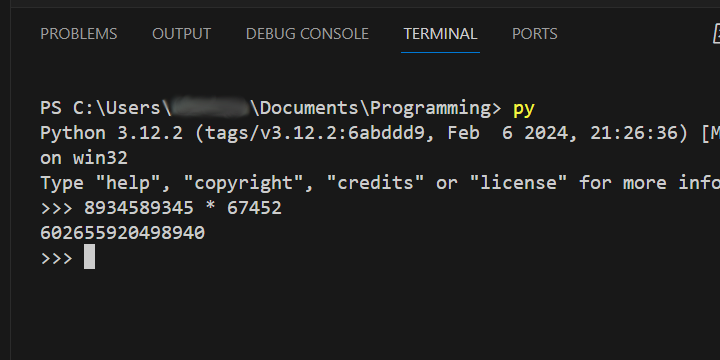
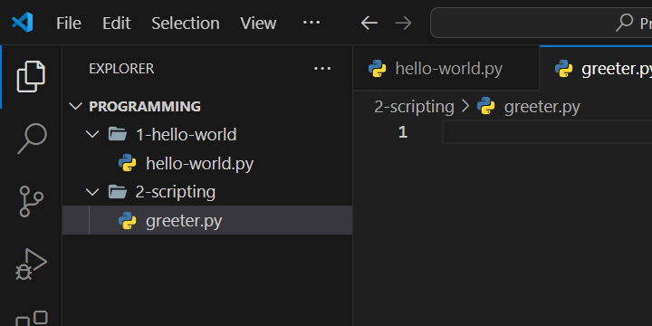

# Luces, camara, acción!

Durante este breve tutorial, nos familiarizaremos con el concepto de "scripting" en programación. Entenderemos cómo interpreta nuestro código Python.

También presetnaremos operadores matemáticos básicos y el concepto de variables y tipos (primitivos).

## Entra al REPL

Antes de empezar, deberíamos saber que podemos pedir que Python realice acciones como sumar, restar, multiplicar o dividir números.

Abre una terminal nueva en tu editor de código (O ejecutan una nueva terminal de Powershell)
Open a new terminal in your code editor (Or open a new Powershell terminal). 



Entra a la terminal, y ejecuta el comando `py` o `python` (Que debería estar disponible porque instalamos python).

Accedimos al REPL de Python (Read-Eval-Print-Loop o ciclo de lectura, evaluación y salida), una herramiente que te permite ejecutar código Python de forma interactiva.

Por ejemplo, podríamos utilizar Python como una calculadora, pidiendo que nos ayude a multiplicar números grandes.



Prueba ejecutar otras operaciones matemáticas usando los operadores matemáticos de suma, resta, multiplicación o división (`+`, `-`, `*`, `/`).



**Tip**  

Siempre puedes volver al REPL ejecutando el comando `py` o `python` en una terminal.


## Crea un programa nuevo

Crea una carpeta nueva dentro de tu carpeta de proyectos de programación de la siguiente manera: `<Programacion>/2-scripting`. Y crea un nuevo programa (archivo) `saludador.py`. Tu estructura de carpetas debería verse algo así:



Python lee nuestros archivos de código como un actor leería el guión de una película y se esfuerza por seguirlo de una forma muy precisa. Cada línea de código le indica a Python qué acción debe ejecutar.

`print` le hará saber a Python que debe imprimir algo a la consola, `input` hará que Python pida la entrada de un usuario y luego la "*recordará*", almacenándola en una `variable`.

Escribiremos un programa sencillo que saludará al usuario por su nombre.

```python
nombre = input("¿Cómo te llamas?")
print("Hola,", nombre)
``` 


**Importante**  

`nombre = input("¿Cómo te llamas?")` hará que Python le pregunte al usuario su nombre, y luego lo recordará, almacenándo su nombre en una `variable` llamada `nombre` utilizando el operador `=`.


`print` puede imprimir varias cosas si utilizamos `,` como separador. En este caso estamos imprimiendo el texto `"Hola,"`, seguido del nombre del usuario.


## ¿Qué puede recordar Python? (Tipos de variables)

Podemos pedir a Python que recuerde algo utilizando un `Operador de asignación` (`=`). Se llama así porque estamos `asignando` valor a una variable.

Cada vez que utilizamos el operador de asignación (`=`), Python le pedirá a tu computadora un espacio en la memoria para poder guardar la información. Python, tomará nota de dónde guardo la información tomando como referencia el nombre de tu `variable` (ej. `usuario`) para recuperar la información cada vez que la pidas.

En `nombre = "Jhon"`, le pedimos a Python que recuerde `"Jhon"` cuando pedimos `nombre`. En otras palabras, estamos `asignando` el valor `"Jhon"` a la variable `nombre`.

Podemos pedir que Python recuerde información de varios tipos. Vermemos algunos `tipos` básicos que podemosutilizar.

### Texto

Como hemos visto, podemos asignar `texto` a variables. En programación, un fragmento de texto suele llamarse `string`, para Python se llama `str`.

ej.

```python
nombre = "John"
print("Hola,", nombre)
```


**Tip**  

Puedes crear archivos en tu carpeta de proyectos de programación para guardar estos fragmentos de código.


### Números

También podemos asignar `numeros` a variables. Python diferencia entre tres `tipos` de numeros:
* `int` para numeros enteros (como los que podemos contar con las manos, incluyendo números negativos).
* `float` para números de punto (o coma) flotante (o números que incluyen decimales usando notación científica).
* `complex` para números complejos (no utilizaremos este tipo de números por ahora).

e.g.
```python
radio = 2
pi = 3.14159
area = radio * pi
print("El área de este círculo es", area)
```


**Importante**  

En este caso, `radio` sería un número entero (`int`) y `pi` sería un numero de punto flotante (`float`).
Como `area` es el resultado de un cálculo que involucra un número de punto flotante, será también un número de punto flotante (`float`).


### Valores de verdad

También podemos asignar `valores de verdad` a variables. Para entender si algo es verdadero (`True`) o falso (`False`), usamos valores de verdad o `Booleanos` (En honor a George Bool). Python llama este tipo de datos `bool`.

e.g.
```python
programarEsCool = True
print("¿Programar es Cool?", programarEsCool)
```

## Calculadora parlante

Ahora escribiremos un programa que pide a un usuario dos números (enteros o `int`) y los multiplica.

```python
print("Te puedo ayudar a multiplicar dos números")
primerNumero = input("¿Cuál es el primer número?\n")
segundoNumero = input("¿Cuál es el segundo número?\n")
resultado = primerNumero * segundoNumero
print("El resultado de tu multiplicación es:\n", resultado)
```


**Tip**  

Cuando escribimos texto en Python usando `strings` y queremos que el texto se imprima en una línea nueva (como cuando presionas `Enter` mientras editas un archivo de texto), podemos hacer uso de *saltos de línea* utilizando `\n`.


Si ejecutamos el código escrito arriba, nuestro programa fallará. Esto se debe a que Python asume que todo lo que escribe un usuario durante la operación `input` es texto(`str`). Debemos indicarle a Python que lo que el usuario ingreso no es en realidad un texto, sino un número.

```python
print("Te puedo ayudar a multiplicar dos números")
primerNumero = input("¿Cuál es el primer número?\n")
segundoNumero = input("¿Cuál es el segundo número?\n")
resultado = int(primerNumero) * int(segundoNumero)
print("El resultado de tu multiplicación es:\n", resultado)
```


**Importante**  

Cuando pedimos a python que multiplique las entradas, utilizamos `int(primerNúmero)` para pedir a Python que asuma que la información en la `variable` dentro de los paréntesis es un número entero (`int`) y no texto.  
*Siempre que los valores sean números* Python los multiplicará.


## Más programas

Puedes tomar una o más ideas de esta lista para practicar:

* Escribe un programa que pide al usuario dos lados de un rectángulo y calcula su área.
* Escribe un programa que ayude a un usuario a convertir una moneda en otra.
* Escribe un programa que calcule la distancia entre dos puntos.
