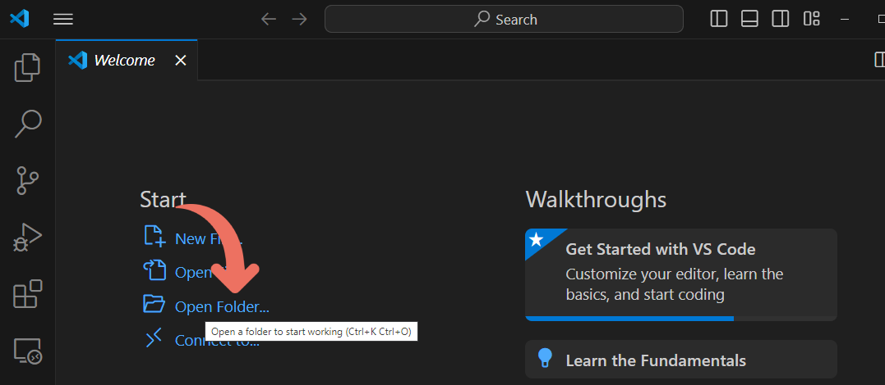
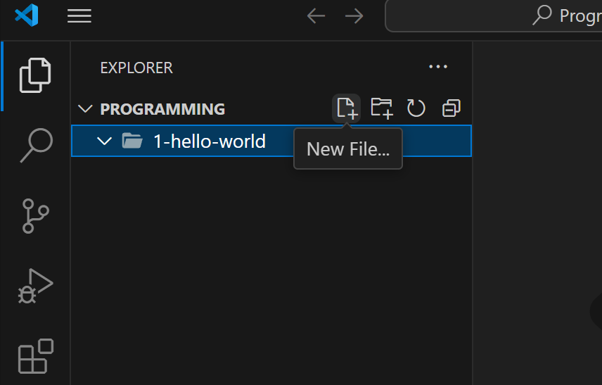

# From zero to hero

These small tutorials are aimed to teach adults on how to think, and write code to help in daily endeavors.

Hopefully every simple program we write, will help you grasp algorithms and write code that can help you enhance or even automate tasks in your daily life.

In this tutorial, we wil set-up a code environment, install a code editor, Python (a programming language) and write a simple hello world program.

## Visual Studio Code

Download and install the [Visual Studio Code](https://code.visualstudio.com/) editor. This will be the main tool we use to write, and run our programs.

Install the Python extension if it's not installed, click on the extensions side bar menu (Or use the keyboard shortcut `Ctrl+Shift+X`).


Check if the Python (By Microsoft) extension is installed or install it by searching it in the Marketplace and adding it to the code editor.


## Install Python

We'll start by installing Python, a very popular, powerful and easy to use programming language.

### Using Chocolatey (Recommended)

Install [Chocolatey](https://chocolatey.org), a "package manager" for windows environment.

Chocolatey will help you install programming software through an easy to use command line interface. It will also help you (with some assistance) to update or remove programming software with ease.

Press the `Windows` key and search for the `Powershell`, right click on the `Windows Powershell` entry and select `Run as administrator`.


Head over to [the Chocolatey install page](https://chocolatey.org/install) and follow the instructions by running the instructed command on your `Powershell` terminal.

Repeat the instructions above to open yet another `Powershell` terminal with administrative rights. And run:

```powershell
choco install python
```

When everything is done run:

```powershell
python --version
```

To make sure python is installed.

### Directly

Head over to the [Python windows install page](https://www.python.org/downloads/windows/) and download the `Windows installer`. Download the appropiate installer (`64-bit` or `32-bit`) for your machine.

> To tell which one you need, select the `Start` button, then select `Settings > System > About` . At the right, under `Device specifications`, see `System type`.

## Hello world!

Create a folder for our programming journey, a recommended folder would be in your Documents folder under the `Programming` folder (the `<Programming>` folder from now on).

Open the folder within VisualStudio Code using the `Open folder` shortcut, or by selecting the option through the `File>Open folder` menu.



Create a new folder for this section either on your file explorer or through VisualStudio Code named `1-hello-world`.


Then, create a new file `hello-world.py`, using the new file button or by pressing `Ctrl+N`.



Now, click on the file to start editing and we will write now our first program that greets everyone through the console interface.

```python
print("Hello world")
```

Make sure to save your file before running (`Ctrl`+`S`). Hit the play button and watch as your program comes to life and greets everyone.


Continue onwards
