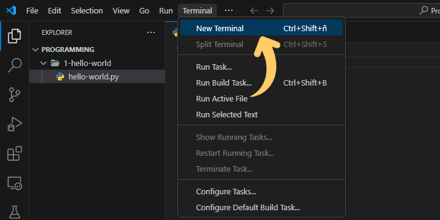
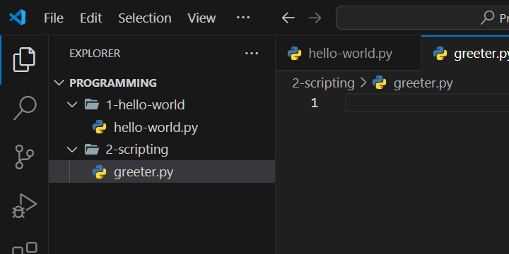

# Lights, camera, action!

Get familiar with the script concept in programming. Understand how code is "interpreted" and why it is interpreted by Python.

We will introduce simple math operators and the concept of variables and (primitive) types.

## Enter the REPL

We can ask Python to perform actions for us, like adding, substracting, multiplying or dividing  numbers.

Open a new terminal in your code editor (Or open a new Powershell terminal). 



Head to the terminal and prompt a `py` command (Which is available because we installed python last time).

We have now entered the Python REPL (Read-Eval-Print-Loop), a tool Python offers for you to run Python code in an interactive fashion.

Now we can use Python as a calculator, we can ask them to multiply two really big numbers for example.


Try out addition, substraction, division or multiplication using the math operators (`+`, `-`, `*`, `/`).



**Tip**  
  
You can always come back to the REPL by typing `py` or `python` on a new terminal.


## Create a new program

Create a new folder within your programming projects folder like so: `<Programming>/2-scripting`. And create a new program `greeter.py` within the folder. Your folder structure should look like so:



Python reads our code files as an actor would a move script and does it best to follow it very precisely. Each line prompts python to perform an action.

`print` will tell Python to print something to the console, and `input` will prompt Python to ask an user for input, and then "*remember*" it, storing it inside a `variable`.

We will write a simple program that will greet the user by their name.

Sample program:

```python
username = input("What's your name?")
print("Hello,", username)
``` 



**Important**  

`username = input("What's your name?")` will promp Python to ask the user for their name, and then remember that name and store it in a `variable` called `username` using the `=` operator.


`print` can print multiple things if we use `,` as a separator, in this case, we are printing the text `"Hello,"` text, followed by the user's name we told Python to remember.


## What can Python remmember? (Variable types)

We can tell Python to remember something using the `Assignment operator` `=`. It's called that because we are `assigning` a value to a variable.

Whenever we use the assignment (`=`) operator, Python will ask the computer for a space in memory to store the data in. Python then will take note of the location the data went in to recover it every time we ask for it.

In `name = "Jhon"`, we're telling Python to remember `"Jhon"` when we ask for `name`. In other words, we are `assigning` the value `"Jhon"` to the variable `name`.

Python can remember all sorts of stuff. We will see some basic things (`types`), Python can remember.

As we've seen, we can assign `text` to variables. In programming a piece of text is usually called a `string`, Python calls this `str`.

e.g.

```python
name = "John"
print("Hi,", John)
```


**Tip**  

You can create files in your programming folder for these pieces of code and watch them run on your computer.


We can also assign `numbers` to variables. Python can tell the difference between three `types` of numbers:
* `int` for integer numbers
* `float` for floating point numbers
* `complex` for complex numbers (we won't use this very much)

e.g.
```python
radius = 2
pi = 3.14159
area = radius * pi
print("The area of this circle is", area)
```


**Important**  

In this case, `radius` would be an `int`, `pi` a `float`.
Because `area` is the result of a computation that involves a `float`, it is as well, a `float`.


We can also assign `truth values` to variables. To discern if something is `True` or  `False`, we use truth values, or `Booleans`, Python calls these `bool`.

e.g.
```python
codingIsCool = True
print("Is coding cool?", codingIsCool)
```

## Multiply two big numbers, please

We will now write a simple program that asks the user for two (integer) numbers and multiplies them together.

```python
print("I can help you multiply two numbers")
firstNumber = input("Whats the first number?\n")
secondNumber = input("Whats the second number?\n")
result = firstNumber * secondNumber
print("Your multiplication is done, the result is:\n", result)
```

**If** we run the code above, our program will fail. The reason is Python assumes everything you type through the `input` is a text(`str`). We have to tell Python the input is not a text, but a number.

```python
print("I can help you multiply two numbers")
firstNumber = input("Whats the first number?\n")
secondNumber = input("Whats the second number?\n")
result = int(firstNumber) * int(secondNumber)
print("Your multiplication is done, the result is:\n", result)
```

> When we ask python to multiply the inputs, we use `int(firstNumber)`, this asks Python to assume the `variable` within the parenthesis is an integer number(`int`) and not a text.  
> As long as the values **are numbers** Python will multiply them for you.

## Homework

You can one or more programs from this list to practice some more:

* Write a program that asks the user for two sides of a rectangle, and prints out the area for said rectangle.
* Write a program that helps a user with currency exchange (from one currency to another).
* Write a program that calculates the distance between two points
